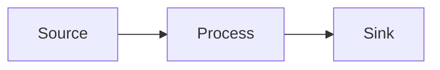

<p align="center">
  
</p>

<p align="center">
  <a href="https://github.com/silvano-moraes-de-souza/de-project-template/actions/workflows/ci.yml"></a>
  
  
  <a href="https://github.com/silvano-moraes-de-souza/30-days-data-eng"></a>
</p>

> Starter layout for the 30 Days of Data & Software Engineering series

<!-- template-only:start -->
## Using this template

Every project in the series starts from here. One command creates the repo with the package renamed, the README filled, the banner rendered and the first commit made:

```bash
uv run python scripts/new_project.py ../ecommerce-data-pipeline \
  --day 1 --title "E-commerce Data Pipeline" \
  --tagline "Batch ETL from raw orders to a PostgreSQL star schema" \
  --stack Python PostgreSQL Docker
```

What comes with it:

| Piece | Where |
|---|---|
| Benchmark harness (wall time, peak RSS, machine info, git sha) | `bench/harness.py` |
| Chart renderer for benchmark JSON | `bench/plot.py` |
| Animated banner (SVG + CSS, no JavaScript, renders on GitHub); swap `--scene` for one that shows the project | `scripts/animated_banner.py` |
| README rules every project must meet | [`docs/README_RULES.md`](docs/README_RULES.md) |
| CI: ruff + pytest on Python 3.11 to 3.13, Docker build | `.github/workflows/ci.yml` |
| Dependabot, issue and PR templates | `.github/` |
| Docker image with uv, non-root user | `Dockerfile` |

What `bench/plot.py` produces from a benchmark JSON (here, from shopflow-datagen):


This section is removed from generated projects.
<!-- template-only:end -->

<!-- One or two sentences: who has the problem, what breaks without this. -->

## Problem

<!-- The concrete situation. Numbers only if they come from a source or from a run. -->

## Solution

<!-- What this project does about it, in plain terms. -->

## Architecture



## Tech stack

| Layer | Choice | Why |
|---|---|---|
| Language | Python 3.11+ | |

## Quickstart

```bash
uv sync
uv run pytest
```

With Docker:

```bash
docker compose up --build
```

## Results

<!-- Every number here comes from results/*.json. Link the file. If there was no gain, say so. -->

| Metric | Value | Source |
|---|---:|---|
| | | `results/<name>.json` |


Reproduce with `uv run python -m bench.<script>`.

## How it works

## Project structure

```
src/project_template/   application code
tests/                  pytest suite
bench/                  benchmark harness and scripts
results/                raw benchmark output (JSON, committed)
docs/assets/            charts and images generated from results/
```

## Engineering decisions

| Decision | Alternatives considered | Reason |
|---|---|---|
| | | |

## Trade-offs and limitations

## Next steps

## Part of the series

This is day XX of [30 Days of Data & Software Engineering](https://github.com/silvano-moraes-de-souza/30-days-data-eng).
Previous: <!-- link --> · Next: <!-- link -->

## Author

Silvano Moraes de Souza · [GitHub](https://github.com/silvano-moraes-de-souza) · [Portfolio](https://silvanomsouza.vercel.app/)
